# What Goes in a Structured State? Field Ablations for Language-Model Robot Control

Kevin Hopkins · kevinhop@usc.edu · September 2026

**Abstract.** Language models increasingly act in visual and spatial domains through text, yet it is not well characterized which information a text description of a robot scene must carry for a model to act on it. We present statebench, a set of simulated tasks in MuJoCo (pick-and-place, a button press, pen tracing with a dexterous hand, and drawing from a reference image) in which each scene is written out as a structured state: tracked positions, a skill menu, optional derived labels and a goal line. A fast System 1 model (Jev) reads the state and picks the next skill, and a slower System 2 model (GPT-6 Sol) writes goals from demonstration video and stroke plans from reference images. In pre-registered ablations with 50 seeded episodes per condition, tracked positions with a complete goal reach 50/50 on pick-and-place, and adding derived meaning labels and procedure fields lowers success to 45/50. A goal that leaves out the ending scores 17/50, below no goal at all (49/50), because the narrow skill menu encodes the task by itself, and derived labels partly repair the incomplete goal (28/50 and 47/50). Contact errors are asymmetric: a false "not touching" ruins every drawing, and a false "touching" is harmless. Goals written from video rarely state how the task ends and copy failed attempts as intent, and a finish skill that lifts the pen removes the resulting drawing failure. When Sol plans drawings, one-shot programs receive the highest blind ratings, rounds of the whole picture rate clearly lower, and part-wise decomposition needs an explicit layout to approach one shot. We release the harness, tasks, verifiers and statistics code.

## 1. Introduction

Language models increasingly act in domains we think of as visual and spatial: operating robot arms, flying drones, modeling in 3D, painting. The common thread is that each task reaches the model as text. A camera frame, a joint configuration or a canvas is distilled into a textual description of the scene, and the model's decision comes back as text [1]. We call this description a *structured state representation*. At a given step it should hold everything a model needs to choose an action that moves the scene toward the desired state at the next step.

This framing raises a practical question that has received little direct study: which information must a structured state carry, and which of its fields must be produced accurately when states are generated at scale, for instance as training labels? A second, related question concerns speed and cost. Language models are slow relative to control rates, and generating one decision per control step is expensive. A two-system design addresses this. A fast System 1 model reads the structured state and picks the next skill at every decision, while a slower System 2 model writes the plan and the goal into the state and steps in only when a step fails [2, 3, 4, 5]. Under this design the structured state is the handoff between the two models, and its contents decide whether the robot succeeds.

We study both questions in **statebench**, a set of simulated tasks in MuJoCo [6]: pick-and-place with an xArm7, a button press, a pen that traces target strokes with a dexterous hand, and a drawing task in which a model writes every stroke of a drawing of a painting and the robot executes them. Each scene is written out as a structured state with four kinds of fields: tracked positions with simulated tracker noise, a menu of skills, optional derived labels, and a goal line. Jev [3], a System 1 model that returns structured decisions in about 0.2 seconds, plays the planner. GPT-6 Sol [7] plays System 2: it writes goals from demonstration video and writes stroke plans from reference images. Robot-control conditions run on 50 seeded episodes each and drawings are rated blind, with prompts, analyses and decision rules hashed before the runs that test them.

Our findings, in brief:

- **Tracking plus a complete goal is enough.** On pick-and-place, tracked positions with a goal that states how the task ends reach 50/50. Adding derived meaning labels and procedure fields to that state lowers success to 45/50 through looping.

- **The goal is the defining field.** A goal that omits the ending scores 17/50 on positions alone, worse than no goal at all (49/50). The derived labels partly repair the incomplete goal (28/50 and 47/50). With no goal, the narrow skill menu itself encodes the task.

- **Fine contact is asymmetric.** For a pen held by a dexterous hand, a label that falsely reports "not touching" ruins every drawing, while one that falsely reports "touching" does no harm. Contact at millimeter scale needs precision beyond tracking.

- **Goals written from video copy the video.** Sol's goals rarely state how a task ends and reproduce failed attempts as intent. A finish skill that lifts the pen removes the drawing failure regardless of what the goal says.

- **Planning a drawing works best in one shot.** In blind ratings, one-shot stroke programs rate highest and rounds of the whole picture rate clearly lower. Parts drawn one at a time need an explicit layout to come close, and rounds recover on automatic scores when given the coordinates of their earlier strokes.

We release the harness, tasks, verifiers and statistics code.

## 2. Related Work

**Language models choosing robot skills.** SayCan grounds a language model's choice among pretrained skills in learned affordances [8]. Code as Policies has the model write policy code that calls perception and control primitives [9], and Inner Monologue feeds textual observations and success detection back into the planning loop [10]. Our planners likewise choose from a fixed skill menu given a textual description of the scene. We hold the model and the menu fixed and ablate what the description contains.

**Fast and slow systems.** The distinction between fast, automatic and slow, deliberate processing [2] has recently shaped robot architectures that pair a vision-language model with a fast action module, such as Helix [4] and GR00T N1 [5]. Here the fast system is itself a language-in, decision-out model [3], and both systems communicate only through the structured state.

**Text as the interface.** The argument that text is the universal interface for language models [1] underlies computer-use agents and tool use. Our question is narrower: for a spatial task, which parts of the textual description carry the information the decision needs.

**Subgoals and annotations for robot foundation models.** Vision-language-action models are trained with language subtask annotations, metadata and subgoals [11, 12, 13]. We test decomposition from the planner's side, asking when splitting a goal into parts or rounds helps a model that writes the whole plan itself. Labeling demonstrations at scale is the subject of our companion tool robolabel [14], which annotates video in formats such as LeRobot datasets [15].

**Scenes and models.** The pick-and-place and button scenes use the xArm7 model from MuJoCo Menagerie [16]. The pen and drawing scenes build on the dove-drawing experiment of llm-robotics-playground [17], a Kinova arm with a Shadow Hand holding a pencil.

## 3. The statebench Harness

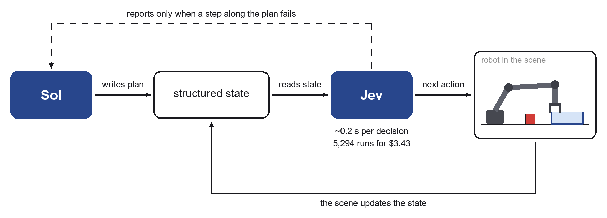

*Figure 1. The two-system design. Sol writes the plan into the structured state, Jev reads the state at every decision and sends the next action to the robot, and the scene updates the state. Jev reports back to Sol only when a step along the plan fails. The latency and cost figures are Jev's, from one round of our runs.*

### 3.1 Tasks

**Pick-and-place.** An xArm7 with a parallel gripper [16] must pick up a 40 mm red cube, placed at a random position and yaw on the table, and put it in a blue receptacle. The skill menu has seven entries: `approach`, `close`, `test_lift`, `transport`, `release`, `inspect` and `retreat` (Appendix A). Each skill runs to completion under a scripted controller, so the planner decides only which skill comes next. The verifier requires the cube inside the receptacle and touching neither finger, the gripper open, and the gripper clear of the receptacle, all held for one second. An episode ends when the verifier resolves, after 24 decisions, or when the same skill is chosen six times with no change in the verifier's conditions.

**Button.** The same arm must press a spring-loaded button until it latches on, release it and move clear. Its menu is `approach_button`, `press`, `release_press`, `inspect` and `retreat`. The verifier requires at least one complete on-and-off cycle, the button off, no contact and the gripper at least 30 mm above the cap, held for half a second, within 16 decisions.

**Tracing.** A Kinova Gen3 arm with a Shadow Hand holds a pencil over a sheet of paper [17]. The target is a set of strokes: outlines traced from three public-domain paintings (The Starry Night, The Great Wave off Kanagawa and Mona Lisa), or the word "ABC". The planner sees each stroke's length, its tracked coverage and how many times it has been drawn, plus the pen state, and chooses among `draw(k)`, `redraw(k)`, `lift` and `finish` (Figure 2). The verifier requires at least 90% of every stroke covered by ink, at most 5% of the ink off the strokes, `finish` called, and the pen lifted at the end.

**Drawing from a reference.** In the drawing task the plan itself comes from a model. Sol receives a reference image and writes a program of `draw`, `lift` and `finish` actions in millimeter coordinates on a 90times90 mm canvas, with at most 60 strokes of 40 points each. The canvas stands for the whole painting, fitted with a 5 mm margin, and the prompt states where the painting's edges fall. The same hand-and-pencil robot executes the program stroke by stroke. Drawings are scored by blind human ratings and by automatic comparison with outlines traced from the reference.

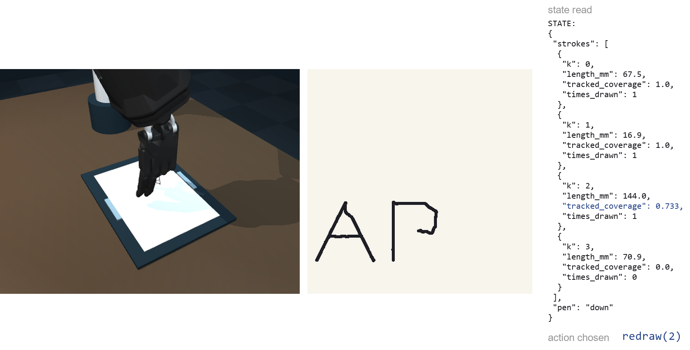

*Figure 2. One decision in the tracing task. Left: the scene and the ink so far. Right: the state Jev read, a list of strokes with their tracked coverage and the pen state, and the skill it chose. Stroke 2 is only 73% covered, so Jev redraws it.*

### 3.2 The structured state

Each decision prompt has the same parts: a one-line role, the goal, the skill menu with one line per skill, a glossary describing only the fields present, the last three actions with the completion events the robot reported for its own commands, the state as JSON, and an output instruction (Appendix A). On pick-and-place the fields come in four groups.

- **Tracking (T):** the cube's position relative to the gripper and relative to the receptacle, the cube's yaw relative to the fingers, the gripper opening and the last gripper command.

- **Meaning labels (M):** yes/no facts computed from the positions: finger contact, the grip state, whether the cube moves with the gripper, whether it is at the receptacle, and whether it was released there.

- **Procedure fields (P):** bookkeeping for the task in progress: whether the gripper is aligned for a grasp, whether the tracking estimate is stale, and the number of close attempts since the last lift.

- **History (H):** the gripper's own position, the age of the tracking estimate, earlier samples of the tracked quantities, the state at the start of each of the last three actions, and the calibrated constants the meaning labels use.

The button task has the same groups with button-specific fields. Tracked positions carry simulated tracker error: a persistent per-episode bias of 5 mm in a random direction plus 2 mm of per-axis jitter on every read. The goal line is the only free text in the state. We compare a goal that leaves out the ending ("Pick up the red cube from the table and place it in the blue receptacle."), a complete goal that states the verifier's ending ("Pick up the red cube, place it in the blue receptacle, then move the gripper clear of the receptacle."), and no goal ("No goal is given.").

### 3.3 Planners

**Jev** [3] is a System 1 model that returns a structured decision rather than free text. We send it the full prompt as the state and the skill lines as the options, and it returns one choice with probabilities. Its median latency was 0.20 s per decision over 49,899 logged decisions. **Sol** [7] is GPT-6 Sol, called through OpenRouter with reasoning disabled and JSON-schema output. It writes goals from demonstration video at temperature 0 and stroke programs at temperature 1.0. For reference we also ran Claude Sonnet 5, which averaged about 2 s per decision, and two local open-weight models.

### 3.4 Protocol and statistics

Robot-control conditions run on 50 seeded episodes each, drawn from a fresh confirmation seed range every round, after development on separate seeds. On a seed-determined subset of pick-and-place episodes the first grasp is forced to miss, 3.5 cm above the cube, so that recovery is tested; on tracing, the first draw of the longest stroke is interrupted halfway. Each round's prompts, conditions, seed ranges and analysis rules were written to a pre-registration file and hashed (SHA-256 over line-ending-normalized bytes) before the runs that tested them, and the files they pin were verified unchanged afterwards. Results are loaded through a manifest that requires exactly one record per condition and seed and rejects archived transport failures. Every rate carries a Wilson interval [20]. In the earlier rounds a contrast counted as clear when the two conditions' Wilson intervals were disjoint. From the fourteenth round on, contrasts between conditions on shared seeds use Tango's paired score interval [18], with Newcombe's interval [19] and an exact sign test beside it. Rating contrasts use the mean of per-reference differences with a bootstrap stratified by reference and condition, 4,000 draws [21]. A contrast is reported as a *clear difference* when its 95% interval excludes zero.

## 4. What the State Needs

*Table 1. Jev's successes out of 50 on pick-and-place by state content and goal, with 95% Wilson intervals where they bound the comparisons in the text. T: tracked positions. M: meaning labels. P: procedure fields. H: history. The no-goal condition was run on two seed sets.*

| Goal | T | T+M | T+M+P | T+H |
|-|-|-|-|-|
| leaves out the ending | 17 [.22, .48] | 28 [.42, .69] | 47 [.84, .98] | – |
| complete | 50 [.93, 1.0] | – | 45 [.79, .96] | 50 |
| none | 49 / 48 | – | – | – |

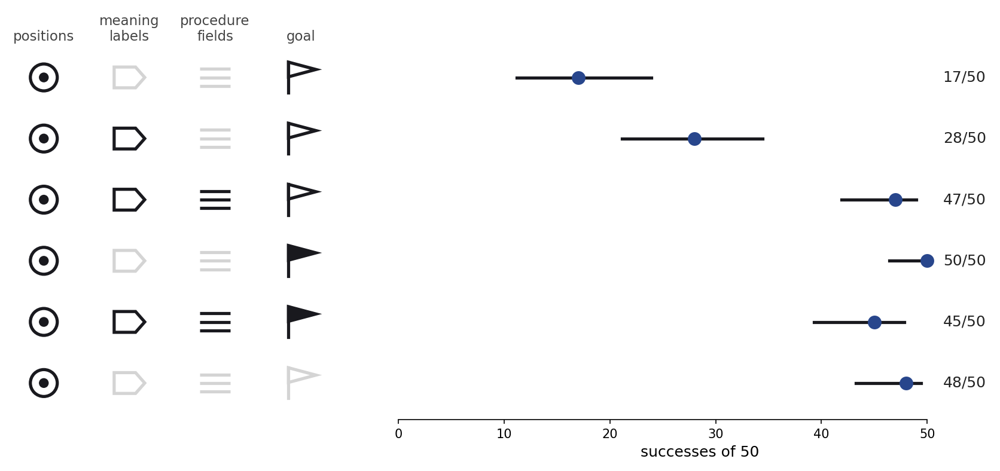

*Figure 3. Jev on pick-and-place, 50 seeded episodes per row, with 95% Wilson intervals. Dark icons mark the fields present in the state. A hollow flag is the goal that leaves out the ending, a filled flag the complete goal and a grey flag no goal (second seed set).*

**With a complete goal.** Table 1 and Figure 3 give Jev's pick-and-place success by the contents of the state. With the complete goal, tracked positions alone reach 50/50, including all 13 episodes with a forced first-grasp miss. Adding the history fields leaves the result unchanged (difference 0.00 [-0.07, +0.07]). Adding meaning labels and procedure fields lowers it to 45/50, a clear difference from the history condition (-0.10 [-0.21, -0.02]). All five failures came after a forced miss: Jev re-approached and closed the empty gripper again and again, without releasing, until the decision cap. Removing a single procedure field, the alignment flag, cost another eight successes (37/50; +0.16 [+0.08, +0.29] for keeping it). The derived fields add ways for the planner to get stuck without adding information it lacks.

**With an incomplete goal.** With the goal that leaves out the ending, tracked positions alone reach only 17/50. Jev places the cube and then keeps working it, re-grasping and carrying it until it runs out of decisions (Figure 5). Meaning labels raise success to 28/50 and procedure fields to 47/50; the second step is a clear difference, and the first is not under the disjoint-interval rule used in that round. The derived labels, computed from the same positions, stand in for the missing end condition. A larger and slower model, Claude Sonnet 5, reached 50/50 on positions alone under both goals, inferring the ending that the fast planner needed spelled out.

**Button.** On the button task Jev completed 50 of 50 episodes with positions alone, with history, and with meaning labels and procedure fields, so no field changed the outcome.

**Noisy positions.** Positions do not need to be exact. A state estimated from RGB-D frames by a tracker with no access to simulator truth, with median position errors under a millimeter, lost nothing against ground truth: all three readers tested at that stage completed 50 of 50 episodes. Meaning labels computed by rules from tracking with 5 mm bias and 2 mm jitter still supported 47 to 50 successes out of 50. Sensor faults of a different kind did matter. A camera offset of 5 mm and 1^circ cut a rule-based reader to 29/50 and 150 ms of latency cut every reader to 0/50, and remedies that use no ground truth, a settling rule, marker-based calibration and relative positions, restored 50/50 and 48/50.

## 5. Fine Contact


*Figure 4. The pen scene on one seed with the contact label wrong half the time. Left: false "not touching" labels send the hand down again and push the pencil out of its grip (0/50 drawings finished). Right: false "touching" labels do no harm (50/50).*

Among the derived labels, the ones that mattered described contact. In the pen scene, a controller draws target strokes using a single Boolean label: it advances along a stroke only while the label reads "touching", holds on "unknown", and descends again after three consecutive "not touching" reads. We injected label errors of one type at a time, at a rate of 0.5 (Figure 4). False "not touching" labels made the controller descend again with the pencil already on the paper, and the repeated descents pushed the pencil out of the hand in every one of 50 drawings. False "touching" labels at the same rate left all 50 drawings intact. The same asymmetry held for timing: label flicker during drawing failed all 50 drawings, and flicker during the descent failed none. At an error rate of 0.2, both error types were harmless.

Whether positions can supply this label depends on how the tracking error is structured. When most of the error is shared between pen tip and paper, it cancels in their difference, and an estimator that compares their smoothed heights matched the true label (50/50). A version that also detects when the tip stalls against the paper reached 49/50. When each object carries its own error at the 3.5 mm scale, the stall-aware estimator fell to between 14 and 25 of 50, and a fixed paper-height threshold reached 8/50. Contact that is decided by a few millimeters therefore needs either correlated tracking or a real contact sensor, such as recorded force or haptic feedback.

## 6. The Goal

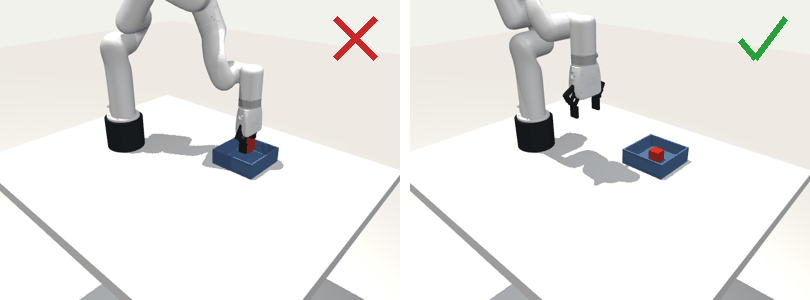

*Figure 5. The same pick-and-place seed under two goals. Left: the goal leaves out the ending, and Jev keeps working the cube over the receptacle until the decision cap. Right: the goal ends with "then move the gripper clear of the receptacle," and Jev releases the cube and moves clear.*

*Table 2. Jev's successes out of 50 by the form of the goal, with tracked positions and the skill menu fixed. The partial goal states an ending short of the verifier's, and the wrong ending states a different one. The no-goal row comes from a later round on different seeds.*

| Goal | Pick-and-place | Button | Tracing |
|-|-|-|-|
| task name only | 50 | 50 | 0 |
| casual request | 50 | 50 | 0 |
| partial goal | 18 | 39 | 0 |
| complete goal | 50 | 50 | 50 |
| complete goal plus steps | 50 | 50 | 50 |
| steps only | 50 | 50 | 50 |
| complete goal, wrong ending | 50 | 37 | 13 |
| no goal | 49 | 50 | 0 |

**The stated ending decides.** We varied the goal while holding tracked positions and the skill menu fixed, from the bare task name to a complete goal with a list of steps (Table 2). On pick-and-place, the task name alone ("pick and place") and a casual request ("Put the block away.") both reached 50/50. The partial goal, which states placement as the end, reached 18/50 (Figure 5). On tracing, every goal that did not say the pen must be lifted at the end scored 0/50, the complete goal scored 50/50, and a complete goal with the wrong ending, one that leaves the pen on the paper, scored 13/50 (a clear difference of -0.74 [-0.84, -0.60]). Adding an ordered list of steps to the complete goal changed nothing on any task. Sol, reading the same partial pick-and-place goal, reached 49/50, a clear improvement of +0.62 [+0.45, +0.75] over Jev.

**A good ending agrees with the verifier.** The pick-and-place verifier requires the gripper to move clear after the release. The partial goal's ending, the cube in the receptacle, stops short of that, and a goal that names no ending at all is less harmful than one that names an incomplete one. A good ending condition agrees with the task's intent and with the verifier that scores it. Demonstrations also contain failed actions, mishandled grasps and premature releases, and a model writing goals from video copies them into the intent (Section 7), so annotating failed attempts as failures is a label worth collecting.

**The menu can carry the goal.** With the goal line replaced by "No goal is given.", Jev still completed pick-and-place on 49 of 50 seeds (48 of 50 on a second seed set, no clear difference from the complete goal) and the button task on 50 of 50. With approach, close, lift, transport, release and retreat on the menu and one cube and one receptacle in the scene, the only task available is to put the cube in the receptacle. The tracing menu does not imply lifting the pen at the end, and with no goal tracing scored 0/50. When the robot's `finish` skill itself lifted the pen, the no-goal condition scored 50/50 on tracing as well. A narrow menu thus encodes the task, at the price of serving that one task only.

## 7. Goals from Video

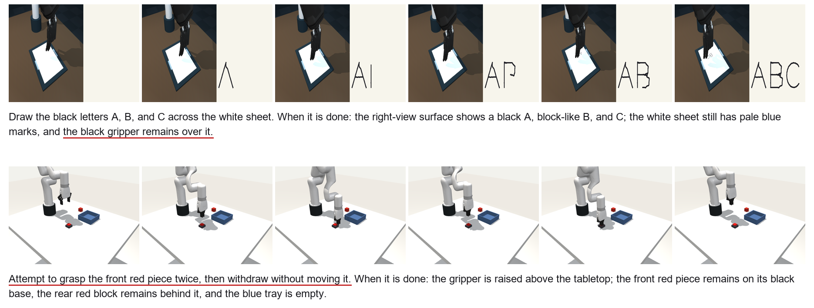

*Figure 6. Goals Sol wrote after watching two demonstrations, under six frames of each. Top: a tracing demonstration, where the goal leaves the gripper over the sheet and never mentions lifting the pen. Bottom: a button press whose first try missed, rewritten as an intent to "attempt to grasp the front red piece twice."*

**What Sol writes.** Sol watched twelve frames from a successful demonstration of each task and wrote the goal. Its goals described what it saw. Of 50 pick-and-place goals, 1 stated the robot's final withdrawal, and of 50 tracing goals, 15 stated that the pen is lifted at the end. When Sol also wrote a list of steps, the withdrawal appeared in 42 of 50 step lists, while the pen lift still appeared in only 18. Failed attempts were copied into the intent: after a button press whose first attempt missed, one goal read "Attempt to grasp the front red piece twice, then withdraw without moving it" (Figure 6). A second, unrelated red cube in the button scene led 21 of 50 button goals to describe a pick-and-place. Executed by Jev, Sol's goals worked on pick-and-place (30 of 30) and on the button (32 of 32), where the menus carry the task, and completed only 15 of 34 tracing episodes, against 50 of 50 for the complete goal.

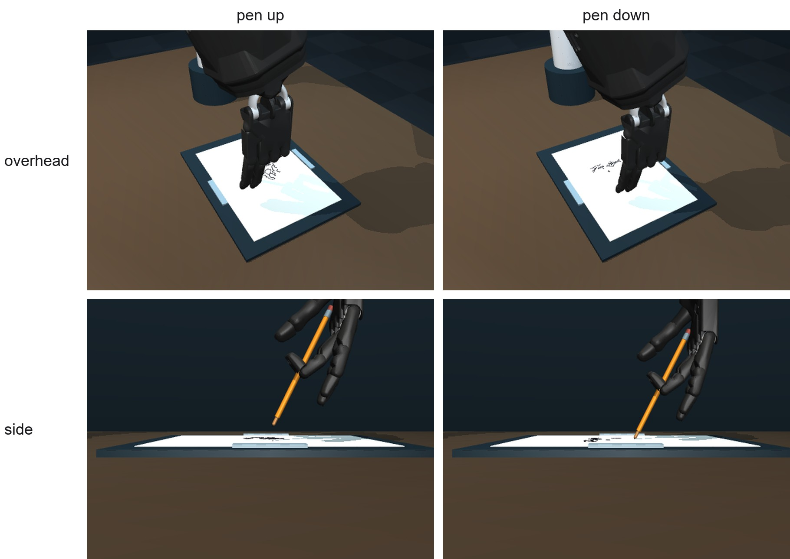

*Figure 7. The pen scene with the pen up and down, from the overhead camera and from a side camera. From one overhead frame Sol answered whether the pen touched the paper correctly 22 of 80 times, and from one side frame 79 of 80 times (an uncertain answer counts as wrong).*

**What the camera shows.** Part of the missing ending is a matter of what the camera can see. On 40 held-out scenes with the pen up or down, Sol answered two questions, whether the tip touches the paper and whether a gap is visible, correctly 22 of 80 times from one frame of the overhead camera and 79 of 80 times from one frame of a side camera at paper height (Figure 7). Counting only committed answers, its accuracy was 0.52 overhead and 0.99 from the side.

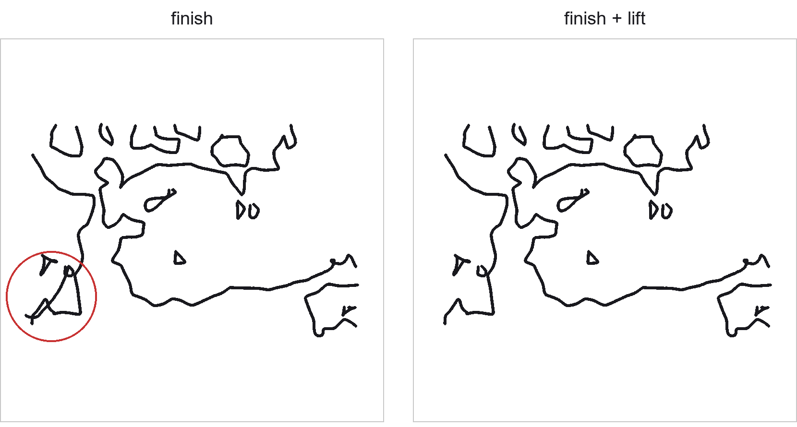

*Figure 8. Final ink of the same drawing replayed with two finish skills. Left: a finish that moves home without lifting the pen drags a line across the page (circled). Right: a finish that lifts the pen first.*

**Putting the ending in the skill.** The most reliable fix left the goal alone. When the robot's own `finish` skill lifts the pen 20 mm before moving home, a drawing ends cleanly whatever the goal says. Replaying 400 finished drawings with a finish that moves home without lifting, 283 dragged a line across the page, with a median length of 31 mm (Figure 8), and success fell to between 25 and 41 of 50.

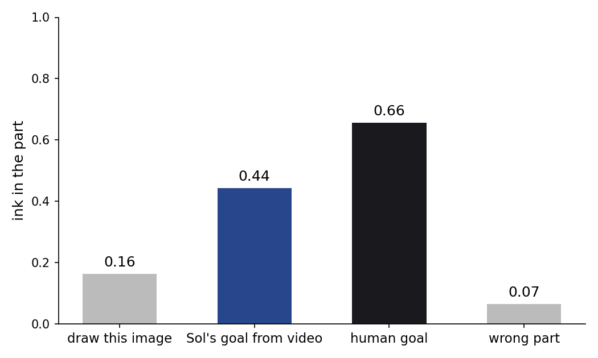

*Figure 9. Watch then draw: the share of ink inside the demonstrated part of a painting when Sol draws from four goals. Sol's goal was written from a video of the robot drawing that part. Means over 12 demonstrations, with executions clustered by demonstration.*

**Watch then draw.** In the drawing domain we asked whether a goal written from video can be carried out again. The robot drew one part of a painting, Sol watched 24 frames and the last two seconds from two cameras and wrote the goal, and Sol then drew from that goal on a fresh page. It named the demonstrated part in 12 of 12 demonstrations. Drawing from its goal put 44% of the ink inside that part, against 16% from "draw this image", 66% from a goal written by a person and 7% from the goal of a different part (Figure 9). Both gaps from Sol's goal are clear differences: +0.28 [+0.17, +0.39] over the generic instruction and -0.21 [-0.37, -0.07] against the human goal. In a blind check, the part was recognizable in 5 of 8 drawings made from Sol's goal and 8 of 8 made from the human goal. From video alone, Sol's goal gets about halfway from a generic instruction to a person's.

## 8. Plans and Decomposition

**Following a plan.** The System 2 model's job is to turn the goal into a plan, and for drawing the plan is a list of strokes. Given a stroke list and the complete goal, Jev completed every tracing episode, including recovery from the interrupted stroke (13 of 13, and 14 of 14 in two later rounds). In a replay check of 180 tracing episodes across goal forms, all 97 failures had covered every stroke and failed only by leaving the pen down. Sol can write a stroke list directly from a picture, which made drawing from a reference our testbed for how a goal should be split before it reaches the robot.

**Five ways to give the job.** Sol drew Mona Lisa and The Starry Night in five ways, with the same robot, executor, canvas mapping, 60-stroke allowance and sampling settings. **One shot** writes the whole program in one reply. The other four use four rounds of at most 15 strokes each, append-only, where every round sees the reference and a top-down picture of the page so far: **rounds** of the whole picture, **rounds by part** with one named part per round, **coarse to fine** with one level of detail per round, and **parts with layout**, which plans a box for each part in the first round and draws each part inside its box. The parts were written by hand. Each way produced 6 rated drawings per painting, and a single rater scored all 60 drawings blind from 1 to 5 in a shuffled gallery.

*Table 3. Blind ratings (1 to 5) by way of giving the job, with the pooled mean's bootstrap interval and output tokens per drawing (Mona Lisa / Starry Night).*

| Way | Mona Lisa | Starry Night | Pooled [95%] | Output tokens |
|-|-|-|-|-|
| one shot | 2.00 | 2.50 | 2.25 [1.83, 2.58] | 1,934 / 3,126 |
| parts with layout | 2.00 | 2.33 | 2.17 [1.92, 2.50] | 2,942 / 3,544 |
| rounds by part | 1.17 | 2.17 | 1.67 [1.25, 2.17] | 2,825 / 4,363 |
| rounds | 1.00 | 1.17 | 1.08 [1.00, 1.25] | 4,142 / 3,884 |
| coarse to fine | 1.00 | 1.00 | 1.00 [1.00, 1.00] | 3,006 / 3,533 |

*Table 4. Rating contrasts: the mean over paintings of the difference between two ways, with 95% intervals from a bootstrap stratified by painting and way (4,000 draws).*

| Contrast | Difference [95%] | Outcome |
|-|-|-|
| rounds - one shot | -1.17 [-1.58, -0.75] | clear |
| rounds by part - rounds | +0.58 [+0.17, +1.08] | clear |
| coarse to fine - rounds | -0.08 [-0.25, +0.00] | no clear difference |
| parts with layout - rounds by part | +0.50 [-0.08, +1.00] | no clear difference |
| parts with layout - rounds | +1.08 [+0.75, +1.42] | clear |

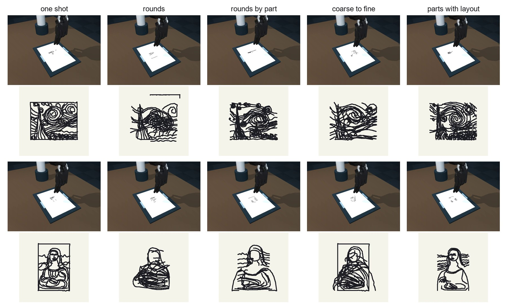

*Figure 10. The five ways on one drawing each, replayed on the robot: The Starry Night (top) and Mona Lisa (bottom). Each column shows the robot above the final ink.*

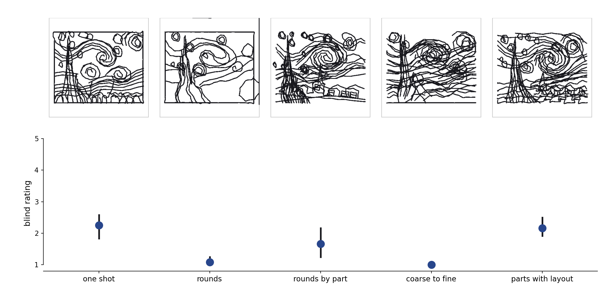

*Figure 11. Mean blind rating by way with bootstrap intervals, and each way's highest-rated Starry Night drawing.*

One shot received the highest mean rating and used the fewest output tokens (Tables 3 and 4, Figures 10 and 11). Rounds of the whole picture rated clearly lower, by more than a point. Naming one part per round clearly helped rounds, and adding the layout brought parts close to one shot. Coarse to fine rated lowest. In an earlier round, giving one-shot Sol a checklist of the painting's main shapes changed its rating by +0.07 [-0.23, +0.40]. The automatic scores, chamfer distance to the traced reference outline, coverage of it and stray ink, separated none of the five ways, although chamfer distance had tracked the ratings across models in that earlier round (Spearman -0.74).


*Figure 12. The Statue of Liberty from words alone, with no reference image: one shot, rounds by part, and parts with a layout. Drawn part by part without a layout, the torch, crown, robe and pedestal pile on top of each other.*

**Parts need a where.** Drawn one at a time, parts lost their spatial relation to each other. From words alone, with no reference image, the Statue of Liberty drawn part by part came out as a pile of parts in the middle of the canvas, while the layout, one box per part planned in the first round, composed the statue (Figure 12). A sub-goal needs a location as well as a description, and cutting a scene into parts also risks leaving something out.

**Rounds need to know what is already there.** We then tested two further conditions on the same paintings, 6 drawings each per painting. In **rounds with coordinates**, every round also received the coordinates of all strokes drawn so far. In **draft, revise, commit**, Sol wrote a full draft program, saw it rendered with its coordinates in each later round and returned a full replacement, and the robot drew only the final program. Against plain rounds, coordinates improved both automatic scores: chamfer distance by -0.007 [-0.011, -0.003] and coverage by +0.089 [+0.039, +0.144], both clear differences. Draft, revise, commit matched one shot on every automatic score, at about 3.5 times the cost. Between rounds, a picture of the page was not enough for Sol to calibrate against what it had already drawn, and grounding the rounds in coordinates restored much of what one shot achieves by planning everything at once.

**Cost and speed.** Jev is billed per input token, and in one round of runs it handled 5,294 episodes and 81.6 million input tokens for about $3.43. On pick-and-place, a successful Jev episode cost about $0.0006 and 3.9 s of wall time, against $0.018 and 102 s for Claude Sonnet 5. A one-shot Sol drawing cost about three cents.

## 9. Discussion

**What goes in the state.** Across tasks, the state that survives the ablations is small (Figure 13). Tracked positions carry most of the information, even with millimeter-scale tracker noise. The action menu constrains what the planner can do, and a narrow menu can carry the task on its own. The goal decides the rest, and the part of the goal that matters most is its ending: the condition under which the task is over, stated in a way that agrees with the verifier that scores it. Derived labels are worth adding in two cases only. They can compensate for a goal that is underspecified, and a contact label is needed wherever success depends on a distance smaller than the tracking error.

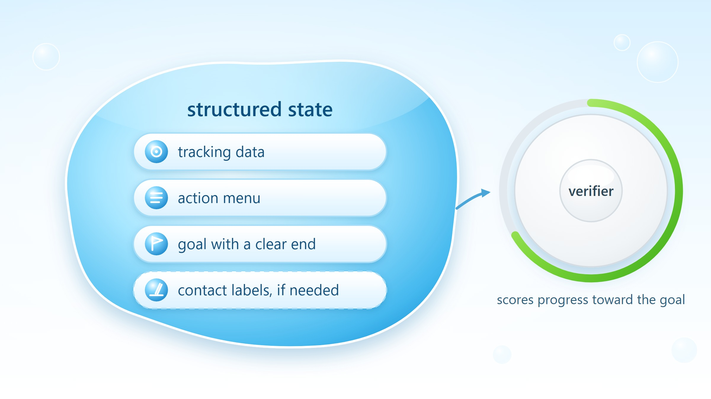

*Figure 13. The structured state that survives the ablations: tracking data, an action menu, a goal with a clear end, and contact labels where millimeters decide the outcome. The verifier sits outside the state and scores progress toward the goal.*

**The goal is the hard part to produce at scale.** Positions can come from a tracker and contact from a sensor, but the goal has to be written by someone. When a model writes it from video, it describes what it saw: the ending tends to go unstated and failed attempts become part of the intent. Two remedies emerged. A skill can absorb the ending, as the lifting finish did for drawing, so that the goal no longer has to state it. Or the labeler can be steered toward the fields that matter: end states, failed attempts recorded as failures, and phase boundaries that break a goal into subgoal actions. The second route is what our companion tool robolabel implements [14].

**Decomposition needs grounding.** Splitting a drawing into rounds or parts lowered its rated quality. The decompositions that held up were the grounded ones: parts placed in a planned layout rated close to one shot, and rounds given the coordinates of their earlier strokes improved on the automatic scores. A picture of the page between rounds was not enough for the planner to calibrate against what was already there. A one-shot plan keeps its own internal calibration of where everything goes.

**From video to a training environment.** The pieces studied here form the outline of a reinforcement-learning environment for spatial skill written entirely in text. Tracking data can be extracted from ordinary video by motion-capture and hand-reconstruction models [22, 23]. A labeler such as robolabel supplies the goal with its end conditions, and the actions it labels supply the action menu. The verifier that scores progress toward the goal supplies the reward. A language model that hillclimbs on that verifier across many such scenes is trained on exactly the interface studied in this paper.

## 10. Conclusion

statebench measures what a text description of a robot scene must contain for a language model to act on it. Tracked positions, a skill menu and a complete goal are sufficient for pick-and-place, and extra derived labels either change nothing or hurt, except where they patch an incomplete goal. The goal's ending is the single most consequential piece of text in the state, and it is exactly what goals written from video tend to leave out. Fine contact is asymmetric and needs precision beyond tracking. When a model plans a drawing, it does best planning the whole thing at once, and decompositions need explicit spatial grounding to work. These results suggest a recipe for producing structured states at scale from video and for training language models on them against a verifier.

## Code and data

The harness, tasks, verifiers, statistics code and figures are available at <https://github.com/kevdozer1/statebench>. The companion blog post, *How chatbotics works*, is at <https://kevdozer1.com/blog/2026/training-chatbots-to-use-robots/>.

## A. An Example Prompt

The complete prompt Jev receives on pick-and-place under condition T with the complete goal. The state values are illustrative. Under T+M and T+M+P the glossary and the state gain the corresponding fields, and under the incomplete goal only the goal line changes.

```
You choose the next skill for a robot arm with a two-finger gripper.

GOAL: Pick up the red cube, place it in the blue receptacle, then move
the gripper clear of the receptacle.

SKILLS:
- approach: move the gripper above the cube's estimated position at
  travel height, then down to grasp height, turning the fingers to the
  cube's estimated yaw; the fingers are not changed.
- close: close the fingers where the gripper is; the arm does not move.
- test_lift: raise the gripper straight up to travel height; the fingers
  are not changed.
- transport: carry the gripper to the receptacle at travel height, then
  lower it to placing height; the fingers are not changed.
- release: open the fingers; the arm does not move.
- inspect: hold still for a moment and observe again.
- retreat: raise the gripper to travel height and move it to the home
  pose.

FIELDS IN THE STATE:
- target_rel_gripper_m: estimated position of the red cube minus the
  gripper's grasp point, in metres, robot base frame (dx forward, dy
  left, dz up), from camera tracking.
- target_yaw_rel_gripper_rad: estimated rotation of the cube about the
  vertical axis relative to the fingers, in radians, from camera
  tracking.
- target_rel_receptacle_m: estimated position of the red cube minus the
  blue receptacle's centre, in metres, robot base frame, from camera
  tracking.
- gripper_opening_m: measured distance between the fingers, in metres.
- gripper_command: the last command sent to the fingers: open or closed.

LAST 3 ACTIONS (oldest first), each with the completion events the
robot reported for its own commands:
1. approach: approach_done

STATE:
{"target_rel_gripper_m": [0.012, -0.034, -0.051],
 "target_yaw_rel_gripper_rad": 0.21,
 "target_rel_receptacle_m": [-0.141, 0.162, 0.008],
 "gripper_opening_m": 0.085,
 "gripper_command": "open"}

Answer with a JSON object {"skill": S}, where S is exactly one of:
approach, close, test_lift, transport, release, inspect, retreat.
```

}

## References

[1] Roon. Text Is the Universal Interface. Scale AI blog, <https://scale.com/blog/text-universal-interface>, 2022.

[2] D. Kahneman. *Thinking, Fast and Slow*. Farrar, Straus and Giroux, 2011.

[3] TypeSafe AI. Introducing System One Models & Jev. <https://typesafe.ai/blog/introducing-system-one-models-and-jev>, 2026.

[4] Figure AI. Helix: A Vision-Language-Action Model for Generalist Humanoid Control. Technical report, 2025.

[5] NVIDIA, J. Bjorck, et al. GR00T N1: An Open Foundation Model for Generalist Humanoid Robots. arXiv:2503.14734, 2025.

[6] E. Todorov, T. Erez, and Y. Tassa. MuJoCo: A Physics Engine for Model-Based Control. IROS, 2012.

[7] OpenAI. GPT-6 Sol. Model `openai/gpt-6-sol`, accessed through OpenRouter, 2026.

[8] M. Ahn, A. Brohan, N. Brown, et al. Do As I Can, Not As I Say: Grounding Language in Robotic Affordances. CoRL, 2022.

[9] J. Liang, W. Huang, F. Xia, P. Xu, K. Hausman, B. Ichter, P. Florence, and A. Zeng. Code as Policies: Language Model Programs for Embodied Control. ICRA, 2023.

[10] W. Huang, F. Xia, T. Xiao, et al. Inner Monologue: Embodied Reasoning through Planning with Language Models. CoRL, 2022.

[11] K. Black, N. Brown, D. Driess, et al. π0: A Vision-Language-Action Flow Model for General Robot Control. arXiv:2410.24164, 2024.

[12] Physical Intelligence. π0.5: a Vision-Language-Action Model with Open-World Generalization. arXiv:2504.16054, 2025.

[13] Physical Intelligence. π0.7: a Steerable Model with Emergent Capabilities. <https://www.pi.website/blog/pi07>, 2026.

[14] K. Hopkins. robolabel: Labels for Robot Learning from Demonstration Video. <https://github.com/kevdozer1/robolabel>, 2026.

[15] R. Cadene, S. Alibert, A. Soare, et al. LeRobot: State-of-the-art Machine Learning for Real-World Robotics in PyTorch. <https://github.com/huggingface/lerobot>, 2024.

[16] K. Zakka, Y. Tassa, and MuJoCo Menagerie contributors. MuJoCo Menagerie: A Collection of High-Quality Simulation Models for MuJoCo. <https://github.com/google-deepmind/mujoco_menagerie>, 2022.

[17] D. Hrybov. LLM Robotics Playground. <https://github.com/dimentary/llm-robotics-playground>, 2026.

[18] T. Tango. Equivalence Test and Confidence Interval for the Difference in Proportions for the Paired-Sample Design. *Statistics in Medicine*, 17(8):891–908, 1998.

[19] R. G. Newcombe. Improved Confidence Intervals for the Difference between Binomial Proportions Based on Paired Data. *Statistics in Medicine*, 17(22):2635–2650, 1998.

[20] E. B. Wilson. Probable Inference, the Law of Succession, and Statistical Inference. *Journal of the American Statistical Association*, 22(158):209–212, 1927.

[21] B. Efron and R. J. Tibshirani. *An Introduction to the Bootstrap*. Chapman & Hall, 1993.

[22] H. Cuevas-Velasquez, A. Yiannakidis, S. Shin, G. Becherini, M. Höschle, J. Tesch, T. Obersat, T. Alexiadis, E. Halilaj, and M. J. Black. MAMMA: Markerless & Automatic Multi-Person Motion Action Capture. arXiv:2506.13040, 2025.

[23] G. Pavlakos, D. Shan, I. Radosavovic, A. Kanazawa, D. Fouhey, and J. Malik. Reconstructing Hands in 3D with Transformers. CVPR, 2024.
