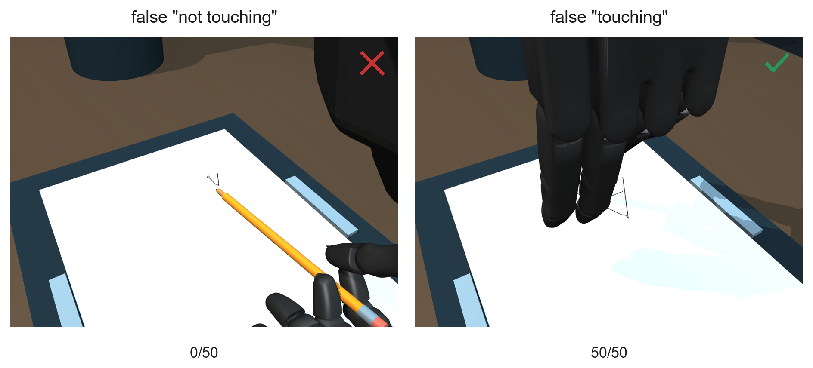
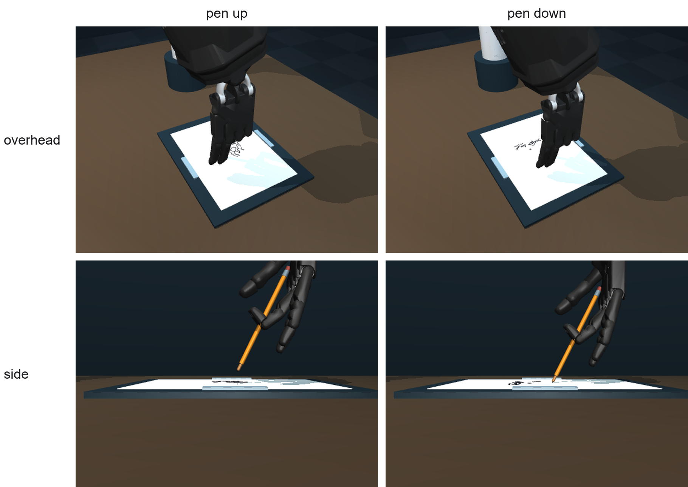
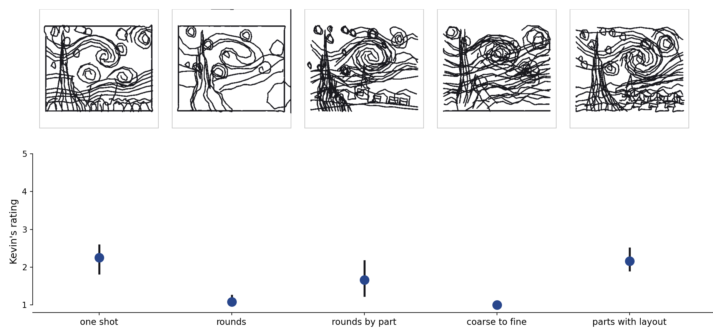
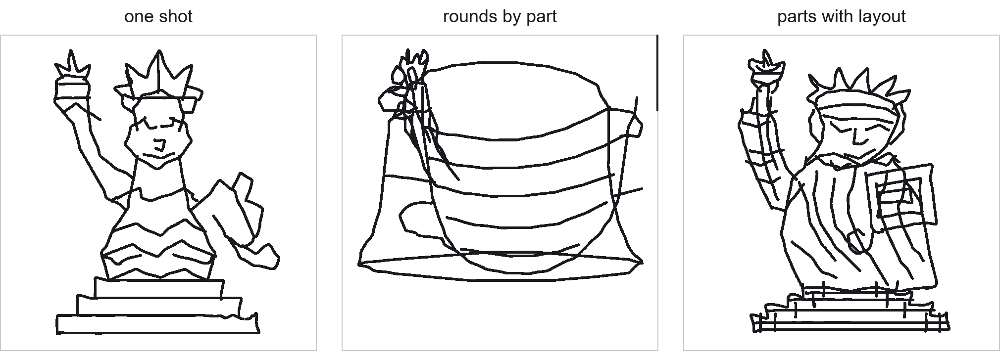

# Results

All numbers are successes out of 50 seeded episodes unless stated. Jev is TypeSafe's System 1 planner and Sol is
OpenAI's GPT-6 Sol, both used frozen. Positions carry simulated tracking noise (up to a 5 mm bias plus 2 mm jitter).

## What the state needs (pick and place, Jev)

Each row is one state. A dark icon means the field is there. Positions are tracked positions, meaning labels are yes/no
facts computed from them ("cube grasped"), and procedure fields are bookkeeping ("grab attempts since the last lift").
A hollow flag is a goal that leaves out the ending, a filled flag is the full goal, and a grey flag is no goal.

| Goal | Positions | + meaning labels | + meaning labels and procedure fields |
|---|--:|--:|--:|
| leaves out the ending | 17 | 28 | 47 |
| complete | 50 | | 45 |
| none | 49 (48 on a second seed set) | | |

With the full goal, the extra fields made Jev loop. A goal that skipped the ending scored 17 to 22 of 50 in four
separate runs. With no goal, the skill menu carried the task.

## Fine contact (the pen scene)

At an error rate of 0.5, a false "not touching" knocked the pen out of the hand in every drawing (0 of 50 finished).
A false "touching" did no harm (50 of 50). This holds for this drawing controller at this error level.

## Goals written from video (Sol)

- The robot's final withdrawal was stated in 1 of 50 goals, and the pen lift in 15 of 50.
- After a button press whose first try missed, one goal read "Attempt to grasp the front red piece twice, then
  withdraw without moving it."
- One unrelated red cube in the scene made 21 of 50 button goals describe a pick and place.
- From the overhead camera Sol said whether the pen was up or down correctly 22 of 80 times, and from a side camera 79
  of 80 (uncertain answers count as wrong).

Making the robot's finish skill lift the pen fixed the drawings whatever the goal said. Without it, 283 of 400 replays
dragged a line at the end.

## Watch then draw

Sol watched the robot draw one part of a painting and wrote a goal. It named the right part 12 of 12 times. Drawing
from its goal put 44% of the ink inside that part, against 16% from "draw this image", 66% from a goal I wrote, and 7%
from the wrong part's goal. In a blind check, the part was recognizable in 5 of 8 drawings from Sol's goal and 8 of 8
from mine.

## Splitting a drawing up

Blind ratings from 1 to 5 by one rater (me, having seen preview drawings), 12 drawings per way over Mona Lisa and
Starry Night:

| Way | Mean rating |
|---|--:|
| one shot | 2.25 |
| parts with a layout | 2.17 |
| rounds by part | 1.67 |
| rounds of the whole picture | 1.08 |
| coarse to fine | 1.00 |

Rounds were clearly worse than one shot, and naming a part per round clearly helped rounds. The layout's gain over parts
alone is not established. One shot used the fewest tokens. A checklist of parts given to one-shot Sol changed its rating
by +0.07. The automatic scores (chamfer and coverage) did not separate the ways that the ratings separated.

Without a reference image, drawing the Statue of Liberty part by part piled the parts on top of each other. In this example, a layout
(one box per part, planned in the first round) put them back in place.

Giving Sol the coordinates of its earlier strokes improved rounds on the automatic scores. Those drawings have not been
rated, so this is a hint only.

## Plans and cost

Jev followed a ready-made stroke list and recovered from every interrupted stroke (14 of 14). Over the project it made
5,294 planning runs for $3.43, at about 0.2 s per decision.
